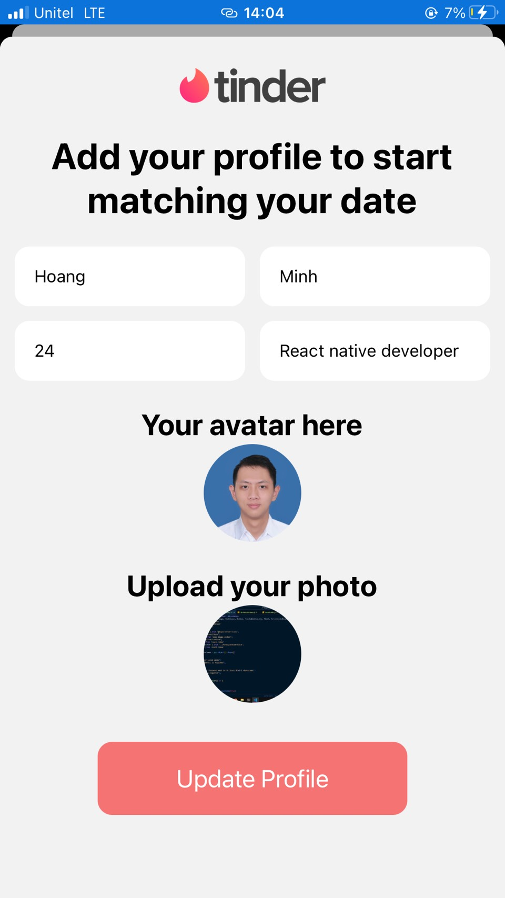
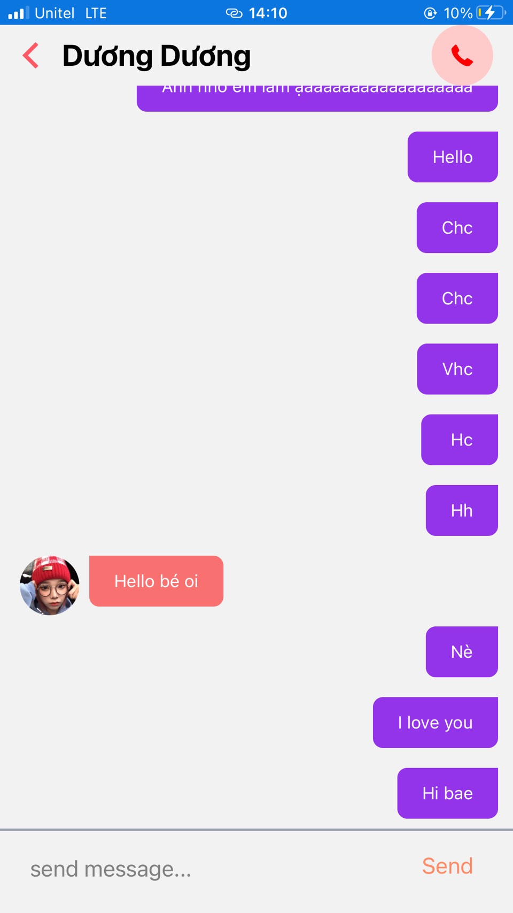

# tinder-mobile-app
## A Tinder clone full-stack react native mobile app with Typescript utilizing backend-as-a-service firebase platform 

>

 &nbsp;  &nbsp; 
     &nbsp;  &nbsp; 

>

### App features and future updates
- Full user authentication using phone number and firebase auth
- Like Tinder, User can swipe left and right and match with other users they wanna macth.
- Real time messaging chat between users who matched with each other.
- Upcoming updates: looking to add new features like unmatch, super like,...

> 

### Stack I use to develop the app
- React native with TypeScript (Expo)
- tailwind CSS (nativeWind library)
- Back-end: firebase with firebase authentication and firestore database
- React native deck swiper: to implement profile card && swipe left/right function
